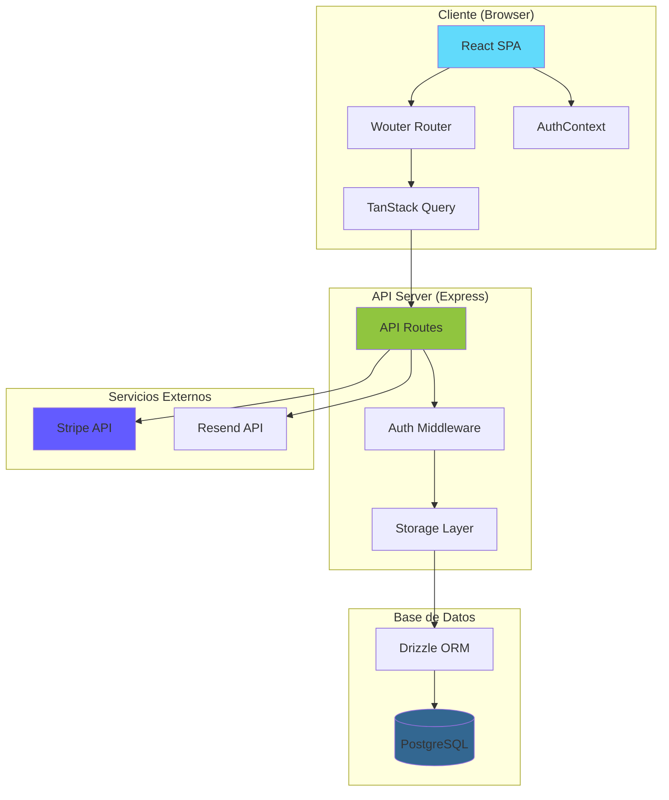
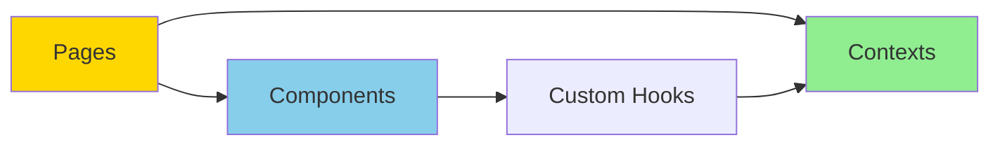
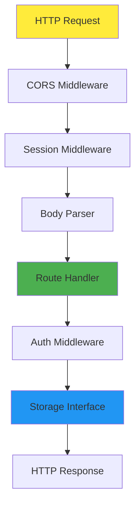
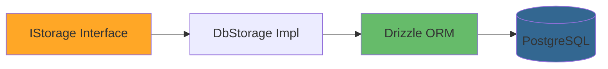
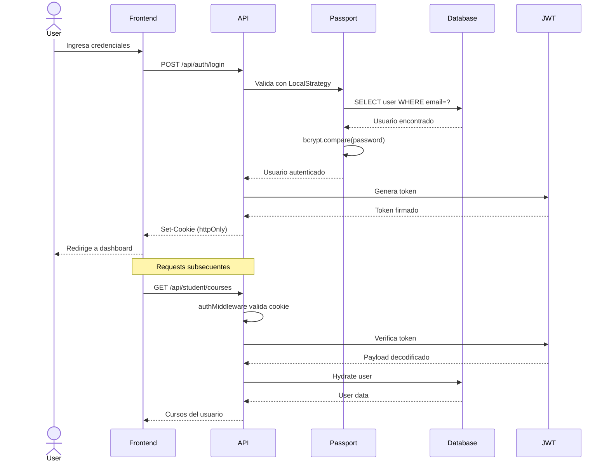

# 🏗️ Arquitectura del Sistema - PsicoBienestar

Documentación técnica de la arquitectura, patrones de diseño y decisiones técnicas del proyecto.

---

## 📑 Tabla de Contenidos

- [Visión General](#visión-general)
- [Diagrama de Arquitectura](#diagrama-de-arquitectura)
- [Capas de la Aplicación](#capas-de-la-aplicación)
- [Flujo de Autenticación](#flujo-de-autenticación)
- [Patrones de Diseño](#patrones-de-diseño)
- [Seguridad](#seguridad)
- [Performance y Caché](#performance-y-caché)

---

## 🎯 Visión General

PsicoBienestar sigue una **arquitectura de 3 capas** con separación clara de responsabilidades:

1. **Capa de Presentación** (React SPA)
2. **Capa de Lógica** (Express API)
3. **Capa de Datos** (PostgreSQL + Drizzle ORM)

### Principios Arquitectónicos

- **Single Page Application (SPA)**: Navegación fluida sin recargas
- **API-First**: Backend expone API REST consumida por frontend
- **Type Safety**: TypeScript end-to-end para reducir bugs
- **Interface-based Storage**: Abstracción de BD para facilitar cambios
- **Stateless API**: JWT para autenticación sin estado de sesión
- **Mobile-First**: Diseño responsive desde el inicio

---

## 📐 Diagrama de Arquitectura



---

## 🎨 Capas de la Aplicación

### 1. Capa de Presentación (Frontend)



#### Responsabilidades

- **Renderizado de UI**: Componentes React
- **Navegación**: Wouter para SPA routing
- **Estado del servidor**: TanStack Query (cache, refetch)
- **Estado global**: Context API (AuthContext)
- **Validación de formularios**: React Hook Form + Zod
- **Estilos**: Tailwind CSS + shadcn/ui

#### Estructura de Componentes

```
/components
├── ui/           → Primitivos de shadcn/ui
│   ├── button.tsx
│   ├── card.tsx
│   ├── form.tsx
│   └── ...
├── Header.tsx    → Navegación global
└── ...

/pages
├── Home.tsx          → Landing page
├── Courses.tsx       → Catálogo
├── Booking.tsx       → Agendar citas
├── StudentArea.tsx   → Área de estudiante
├── AdminDashboard.tsx → Dashboard admin
└── ...
```

---

### 2. Capa de Lógica (Backend)



#### Responsabilidades

- **Routing**: Express.js endpoints
- **Autenticación**: Passport.js + JWT
- **Validación**: Zod schemas
- **Lógica de negocio**: Controllers en routes.ts
- **Acceso a datos**: Storage layer (abstracción)
- **Integraciones**: Stripe, Resend

#### Arquitectura de Rutas

```typescript
// server/routes.ts
router.post('/api/auth/register', registerHandler);
router.post('/api/auth/login', loginHandler);
router.get('/api/courses', getCoursesHandler);
router.post('/api/enrollments', authMiddleware, createEnrollmentHandler);
router.get('/api/admin/*', authMiddleware, requireAdminMiddleware, adminHandler);
```

---

### 3. Capa de Datos



#### Patrón Repository

**Ventajas:**
- ✅ Desacoplamiento de la BD
- ✅ Facilita testing (mocks)
- ✅ Cambio de BD sin tocar lógica
- ✅ Queries centralizadas

**Interfaz IStorage:**

```typescript
interface IStorage {
  // Users
  createUser(data: InsertUser): Promise<User>;
  getUserByEmail(email: string): Promise<User | undefined>;
  getUserById(id: string): Promise<User | undefined>;
  
  // Courses
  getCourses(): Promise<Course[]>;
  getCourseById(id: string): Promise<Course | undefined>;
  
  // Enrollments
  createEnrollment(data: InsertEnrollment): Promise<Enrollment>;
  getEnrollmentsByUserId(userId: string): Promise<Enrollment[]>;
  
  // Admin methods...
}
```

**Implementación:**

```typescript
class DbStorage implements IStorage {
  // Usa Drizzle ORM para queries
  async createUser(data: InsertUser) {
    const [user] = await db.insert(users).values(data).returning();
    return user;
  }
}
```

---

## 🔐 Flujo de Autenticación

### Diagrama de Secuencia



### Componentes de Autenticación

#### 1. Registro

```typescript
// Hash de contraseña con bcrypt
const hashedPassword = await bcrypt.hash(password, 10);

// Crear usuario en BD
const user = await storage.createUser({
  email,
  fullName,
  passwordHash: hashedPassword,
  role: 'student'
});

// Email de bienvenida
await sendWelcomeEmail(email, fullName);
```

#### 2. Login con Passport.js

```typescript
// Local Strategy
passport.use(new LocalStrategy({
  usernameField: 'email'
}, async (email, password, done) => {
  const user = await storage.getUserByEmail(email);
  if (!user) return done(null, false);
  
  const isValid = await bcrypt.compare(password, user.passwordHash);
  if (!isValid) return done(null, false);
  
  return done(null, user);
}));
```

#### 3. JWT Token

```typescript
// Generar token
const token = jwt.sign(
  { userId: user.id },
  process.env.SESSION_SECRET!,
  { expiresIn: '7d' }
);

// Establecer cookie
res.cookie('token', token, {
  httpOnly: true,    // No accesible desde JS
  secure: true,      // Solo HTTPS
  sameSite: 'strict',// CSRF protection
  maxAge: 7 * 24 * 60 * 60 * 1000 // 7 días
});
```

#### 4. Middleware de Protección

```typescript
// Validar JWT en requests
export async function authMiddleware(req, res, next) {
  const token = req.cookies.token;
  if (!token) return res.status(401).json({ error: 'No autenticado' });
  
  try {
    const payload = jwt.verify(token, process.env.SESSION_SECRET);
    req.user = await storage.getUserById(payload.userId);
    next();
  } catch (error) {
    res.status(401).json({ error: 'Token inválido' });
  }
}
```

#### 5. Autorización por Roles

```typescript
// Solo admins
export function requireAdminMiddleware(req, res, next) {
  if (req.user?.role !== 'admin') {
    return res.status(403).json({ error: 'No autorizado' });
  }
  next();
}
```

---

## 🎨 Patrones de Diseño

### 1. Repository Pattern

**Ubicación:** `server/storage.ts`

**Propósito:** Abstraer acceso a datos

```typescript
// Interfaz
interface IStorage {
  createUser(data: InsertUser): Promise<User>;
}

// Implementación
class DbStorage implements IStorage {
  async createUser(data: InsertUser) {
    return await db.insert(users).values(data).returning();
  }
}

// Uso en routes
await storage.createUser({ ... });
```

### 2. Context API Pattern

**Ubicación:** `client/src/contexts/AuthContext.tsx`

**Propósito:** Estado global de autenticación

```typescript
export const AuthProvider = ({ children }) => {
  const [user, setUser] = useState(null);
  
  const login = async (email, password) => { ... };
  const logout = async () => { ... };
  
  return (
    <AuthContext.Provider value={{ user, login, logout }}>
      {children}
    </AuthContext.Provider>
  );
};
```

### 3. Custom Hooks Pattern

**Ubicación:** `client/src/hooks/`

**Propósito:** Reutilizar lógica de estado

```typescript
// useAuth.ts
export function useAuth() {
  const context = useContext(AuthContext);
  if (!context) throw new Error('useAuth must be within AuthProvider');
  return context;
}
```

### 4. Server State Management

**Ubicación:** `client/src/lib/queryClient.ts`

**Propósito:** Cache y sincronización con servidor

```typescript
// TanStack Query
const { data: courses } = useQuery({
  queryKey: ['/api/courses'],
  staleTime: 5 * 60 * 1000 // 5 minutos
});

// Mutations con invalidación
const mutation = useMutation({
  mutationFn: (data) => apiRequest('POST', '/api/enrollments', data),
  onSuccess: () => {
    queryClient.invalidateQueries({ queryKey: ['/api/enrollments'] });
  }
});
```

### 5. Middleware Chain Pattern

**Ubicación:** `server/routes.ts`

**Propósito:** Composición de validaciones

```typescript
router.get(
  '/api/admin/users',
  authMiddlewareWithUser,    // 1. Valida JWT
  requireAdminMiddleware,    // 2. Verifica rol
  async (req, res) => { ... } // 3. Handler
);
```

---

## 🔒 Seguridad

### Medidas Implementadas

#### 1. Autenticación Segura

```typescript
// Contraseñas hasheadas (bcrypt, 10 rounds)
const hash = await bcrypt.hash(password, 10);

// JWT en httpOnly cookies
res.cookie('token', jwt.sign(...), {
  httpOnly: true,   // XSS protection
  secure: true,     // HTTPS only
  sameSite: 'strict' // CSRF protection
});
```

#### 2. Validación de Entrada

```typescript
// Zod schemas en todos los endpoints
const registerSchema = z.object({
  email: z.string().email(),
  password: z.string().min(8),
  fullName: z.string().min(1)
});

const validatedData = registerSchema.parse(req.body);
```

#### 3. Sanitización de Salida

```typescript
// Remover contraseñas de respuestas
function sanitizeUser(user: User) {
  const { passwordHash, ...safeUser } = user;
  return safeUser;
}
```

#### 4. CORS Configurado

```typescript
app.use(cors({
  origin: process.env.FRONTEND_URL,
  credentials: true
}));
```

#### 5. Rate Limiting

**Planeado para v2.0:**

```typescript
import rateLimit from 'express-rate-limit';

const limiter = rateLimit({
  windowMs: 15 * 60 * 1000, // 15 minutos
  max: 100 // límite de requests
});

app.use('/api/', limiter);
```

### Vulnerabilidades Mitigadas

| Vulnerabilidad | Mitigación |
|----------------|------------|
| **SQL Injection** | Drizzle ORM con queries parametrizadas |
| **XSS** | httpOnly cookies + sanitización de entrada |
| **CSRF** | SameSite cookies + origin validation |
| **Session Hijacking** | JWT con expiración corta + regeneración |
| **Brute Force** | Rate limiting (próximo) |
| **Man in the Middle** | HTTPS obligatorio en producción |

---

## ⚡ Performance y Caché

### Estrategias de Caching

#### 1. Client-Side Cache (TanStack Query)

```typescript
// Cache automático de queries
useQuery({
  queryKey: ['/api/courses'],
  staleTime: 5 * 60 * 1000,    // Fresh por 5 min
  cacheTime: 30 * 60 * 1000    // Permanece 30 min
});
```

#### 2. Database Indexes

```sql
-- Índices en columnas frecuentes
CREATE INDEX idx_users_email ON users(email);
CREATE INDEX idx_enrollments_user ON enrollments(userId);
CREATE INDEX idx_appointments_user ON appointments(userId);
```

#### 3. Optimizaciones de Queries

```typescript
// Seleccionar solo columnas necesarias
const courses = await db
  .select({
    id: courses.id,
    title: courses.title,
    price: courses.price
  })
  .from(courses)
  .where(eq(courses.isPublished, true));
```

### Roadmap de Performance

**v2.0 Planeado:**
- ✅ Redis para cache de sesiones
- ✅ CDN para assets estáticos
- ✅ Lazy loading de componentes React
- ✅ Code splitting por ruta
- ✅ Image optimization (WebP)
- ✅ Database connection pooling
- ✅ Gzip/Brotli compression

---

## 📊 Métricas y Monitoreo

**Herramientas Planeadas:**

- **Sentry**: Error tracking
- **LogRocket**: Session replay
- **New Relic**: APM
- **Datadog**: Infrastructure monitoring

---

## 🔄 Escalabilidad

### Arquitectura Actual (Monolito)

```
[Cliente] ←→ [Express API + Vite] ←→ [PostgreSQL]
```

### Arquitectura Futura (Microservicios)

```
[Cliente] ←→ [API Gateway]
              ↓
         ┌────┴────┬────────┬──────────┐
         ↓         ↓        ↓          ↓
    [Auth Service] [Courses] [Payments] [Appointments]
         ↓         ↓        ↓          ↓
    [PostgreSQL] [Redis] [Stripe] [PostgreSQL]
```

---

## 📝 Decisiones Arquitectónicas (ADR)

### ADR 1: SPA vs MPA

**Decisión:** Single Page Application

**Razón:**
- Experiencia terapéutica requiere fluidez
- Navegación sin interrupciones reduce ansiedad
- Mejor UX en general

### ADR 2: Drizzle vs Prisma

**Decisión:** Drizzle ORM

**Razón:**
- TypeScript-first (type inference superior)
- SQL-like syntax (menor curva de aprendizaje)
- Mejor performance
- Menor bundle size

### ADR 3: JWT en cookies vs localStorage

**Decisión:** httpOnly cookies

**Razón:**
- Previene XSS (no accesible desde JS)
- SameSite previene CSRF
- Mejor práctica de seguridad

### ADR 4: Stripe vs PayPal

**Decisión:** Stripe

**Razón:**
- API más moderna
- Mejor documentación
- Checkout embebido superior
- Webhooks más confiables

---

## 🆘 Referencias

- [React Best Practices](https://react.dev)
- [Express.js Guide](https://expressjs.com)
- [Drizzle ORM Docs](https://orm.drizzle.team)
- [JWT Best Practices](https://jwt.io/introduction)
- [OWASP Security Guidelines](https://owasp.org)
