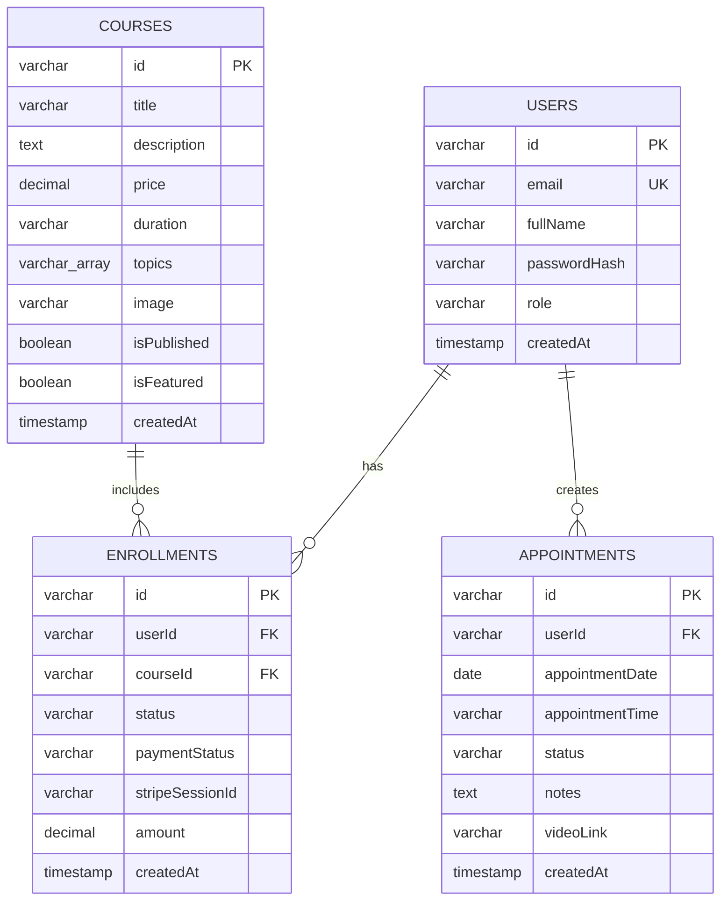

# 🗄️ Esquema de Base de Datos - PsicoBienestar

Documentación completa del modelo de datos, relaciones y gestión de la base de datos.

---

## 📑 Tabla de Contenidos

- [Diagrama Entidad-Relación](#diagrama-entidad-relación)
- [Modelos de Datos](#modelos-de-datos)
- [Relaciones](#relaciones)
- [Índices](#índices)
- [Migraciones](#migraciones)
- [Queries Comunes](#queries-comunes)

---

## 📊 Diagrama Entidad-Relación



---

## 📋 Modelos de Datos

### 1. Users (Usuarios)

Almacena información de todos los usuarios de la plataforma.

**Tabla:** `users`

| Campo | Tipo | Constraints | Descripción |
|-------|------|-------------|-------------|
| `id` | VARCHAR (UUID) | PRIMARY KEY, DEFAULT uuid_generate_v4() | Identificador único |
| `email` | VARCHAR | UNIQUE, NOT NULL | Email del usuario |
| `fullName` | VARCHAR | NOT NULL | Nombre completo |
| `passwordHash` | VARCHAR | NOT NULL | Contraseña hasheada (bcrypt) |
| `role` | VARCHAR | NOT NULL, DEFAULT 'student' | Rol: 'student', 'therapist', 'admin' |
| `createdAt` | TIMESTAMP | DEFAULT NOW() | Fecha de registro |

**Drizzle Schema:**

```typescript
export const users = pgTable("users", {
  id: varchar("id").primaryKey().default(sql`gen_random_uuid()`),
  email: varchar("email").unique().notNull(),
  fullName: varchar("fullName").notNull(),
  passwordHash: varchar("passwordHash").notNull(),
  role: varchar("role").notNull().default("student"),
  createdAt: timestamp("createdAt").defaultNow().notNull(),
});
```

**Zod Validation:**

```typescript
export const insertUserSchema = createInsertSchema(users)
  .omit({ id: true, createdAt: true });

export type InsertUser = z.infer<typeof insertUserSchema>;
export type User = typeof users.$inferSelect;
```

**Roles:**
- `student`: Usuario regular, acceso a cursos y citas
- `therapist`: Profesional de la salud (futuras funcionalidades)
- `admin`: Administrador completo

---

### 2. Courses (Cursos)

Catálogo de cursos disponibles en la plataforma.

**Tabla:** `courses`

| Campo | Tipo | Constraints | Descripción |
|-------|------|-------------|-------------|
| `id` | VARCHAR (UUID) | PRIMARY KEY | Identificador único |
| `title` | VARCHAR | NOT NULL | Título del curso |
| `description` | TEXT | NOT NULL | Descripción completa |
| `price` | DECIMAL(10,2) | NOT NULL | Precio en euros |
| `duration` | VARCHAR | NOT NULL | Duración estimada (ej: "4 semanas") |
| `topics` | VARCHAR[] | NOT NULL | Array de temas cubiertos |
| `image` | VARCHAR | NOT NULL | URL de imagen del curso |
| `isPublished` | BOOLEAN | DEFAULT false | Si está visible públicamente |
| `isFeatured` | BOOLEAN | DEFAULT false | Si aparece como destacado |
| `createdAt` | TIMESTAMP | DEFAULT NOW() | Fecha de creación |

**Drizzle Schema:**

```typescript
export const courses = pgTable("courses", {
  id: varchar("id").primaryKey().default(sql`gen_random_uuid()`),
  title: varchar("title").notNull(),
  description: text("description").notNull(),
  price: decimal("price", { precision: 10, scale: 2 }).notNull(),
  duration: varchar("duration").notNull(),
  topics: text("topics").array().notNull(),
  image: varchar("image").notNull(),
  isPublished: boolean("isPublished").default(false).notNull(),
  isFeatured: boolean("isFeatured").default(false).notNull(),
  createdAt: timestamp("createdAt").defaultNow().notNull(),
});
```

**Estados:**
- `isPublished = false`: Borrador, no visible
- `isPublished = true`: Publicado, visible en catálogo
- `isFeatured = true`: Aparece en home como destacado

---

### 3. Enrollments (Inscripciones)

Registro de inscripciones de usuarios a cursos.

**Tabla:** `enrollments`

| Campo | Tipo | Constraints | Descripción |
|-------|------|-------------|-------------|
| `id` | VARCHAR (UUID) | PRIMARY KEY | Identificador único |
| `userId` | VARCHAR | FK → users(id), NOT NULL | Usuario inscrito |
| `courseId` | VARCHAR | FK → courses(id), NOT NULL | Curso al que se inscribió |
| `status` | VARCHAR | DEFAULT 'pending' | Estado: 'pending', 'active', 'completed' |
| `paymentStatus` | VARCHAR | DEFAULT 'pending' | Pago: 'pending', 'paid', 'failed' |
| `stripeSessionId` | VARCHAR | NULLABLE | ID de sesión de Stripe |
| `amount` | DECIMAL(10,2) | NOT NULL | Monto pagado |
| `createdAt` | TIMESTAMP | DEFAULT NOW() | Fecha de inscripción |

**Drizzle Schema:**

```typescript
export const enrollments = pgTable("enrollments", {
  id: varchar("id").primaryKey().default(sql`gen_random_uuid()`),
  userId: varchar("userId").notNull().references(() => users.id, { onDelete: 'cascade' }),
  courseId: varchar("courseId").notNull().references(() => courses.id, { onDelete: 'cascade' }),
  status: varchar("status").notNull().default("pending"),
  paymentStatus: varchar("paymentStatus").notNull().default("pending"),
  stripeSessionId: varchar("stripeSessionId"),
  amount: decimal("amount", { precision: 10, scale: 2 }).notNull(),
  createdAt: timestamp("createdAt").defaultNow().notNull(),
});
```

**Ciclo de vida:**

```
Usuario se inscribe
    ↓ (status: pending, payment: pending)
Completa pago en Stripe
    ↓ (status: active, payment: paid)
Accede a contenido
    ↓
Completa 100% del curso
    ↓ (status: completed)
```

---

### 4. Appointments (Citas)

Reservas de sesiones terapéuticas.

**Tabla:** `appointments`

| Campo | Tipo | Constraints | Descripción |
|-------|------|-------------|-------------|
| `id` | VARCHAR (UUID) | PRIMARY KEY | Identificador único |
| `userId` | VARCHAR | FK → users(id), NOT NULL | Usuario que agenda |
| `appointmentDate` | DATE | NOT NULL | Fecha de la cita |
| `appointmentTime` | VARCHAR | NOT NULL | Hora (formato "HH:MM") |
| `status` | VARCHAR | DEFAULT 'pending' | Estado de la cita |
| `notes` | TEXT | NULLABLE | Notas del usuario |
| `videoLink` | VARCHAR | NULLABLE | Enlace de videollamada |
| `createdAt` | TIMESTAMP | DEFAULT NOW() | Fecha de creación |

**Drizzle Schema:**

```typescript
export const appointments = pgTable("appointments", {
  id: varchar("id").primaryKey().default(sql`gen_random_uuid()`),
  userId: varchar("userId").notNull().references(() => users.id, { onDelete: 'cascade' }),
  appointmentDate: date("appointmentDate").notNull(),
  appointmentTime: varchar("appointmentTime").notNull(),
  status: varchar("status").notNull().default("pending"),
  notes: text("notes"),
  videoLink: varchar("videoLink"),
  createdAt: timestamp("createdAt").defaultNow().notNull(),
});
```

**Estados:**
- `pending`: Recién creada, esperando confirmación
- `confirmed`: Confirmada por administrador
- `completed`: Sesión realizada
- `cancelled`: Cancelada

**Flujo:**

```
Usuario agenda → pending
    ↓
Admin confirma → confirmed
    ↓
Admin agrega videoLink
    ↓
Sesión realizada → completed
```

---

## 🔗 Relaciones

### Cascade Delete

Todas las relaciones usan `onDelete: 'cascade'` para mantener integridad:

```typescript
// Si se elimina un usuario
userId: varchar("userId")
  .notNull()
  .references(() => users.id, { onDelete: 'cascade' })

// Efecto:
// - Se eliminan todas sus enrollments
// - Se eliminan todas sus appointments
```

**⚠️ Implicaciones:**
- Eliminar usuario → pierde histórico completo
- Eliminar curso → pierde inscripciones asociadas
- **Precaución:** Verificar antes de eliminar

### Relaciones Bidireccionales

**Users ↔ Enrollments:**

```typescript
export const usersRelations = relations(users, ({ many }) => ({
  enrollments: many(enrollments),
  appointments: many(appointments),
}));

export const enrollmentsRelations = relations(enrollments, ({ one }) => ({
  user: one(users, {
    fields: [enrollments.userId],
    references: [users.id],
  }),
  course: one(courses, {
    fields: [enrollments.courseId],
    references: [courses.id],
  }),
}));
```

**Uso:**

```typescript
// Obtener enrollments con datos de usuario y curso
const enrollmentsWithDetails = await db.query.enrollments.findMany({
  with: {
    user: true,
    course: true,
  },
});
```

---

## 📇 Índices

### Índices Automáticos

Drizzle crea automáticamente índices para:
- ✅ Primary Keys (id)
- ✅ Unique constraints (email)
- ✅ Foreign Keys (userId, courseId)

### Índices Adicionales Recomendados

**Para mejorar performance:**

```sql
-- Búsquedas por email (login)
CREATE INDEX idx_users_email ON users(email);

-- Consultas de inscripciones por usuario
CREATE INDEX idx_enrollments_user_id ON enrollments(userId);

-- Consultas de citas por usuario
CREATE INDEX idx_appointments_user_id ON appointments(userId);

-- Filtro de cursos publicados
CREATE INDEX idx_courses_published ON courses(isPublished) WHERE isPublished = true;

-- Filtro de cursos destacados
CREATE INDEX idx_courses_featured ON courses(isFeatured) WHERE isFeatured = true;

-- Búsqueda de citas por fecha
CREATE INDEX idx_appointments_date ON appointments(appointmentDate);
```

---

## 🔄 Migraciones

### Comandos

**Sincronizar schema (sin pérdida de datos):**

```bash
npm run db:push
```

**Forzar sincronización (⚠️ puede perder datos):**

```bash
npm run db:push --force
```

**Abrir GUI visual de BD:**

```bash
npx drizzle-kit studio
```

**Generar tipos TypeScript:**

```bash
npx drizzle-kit generate
```

### Flujo de Cambios

```
1. Modificar schema en shared/schema.ts
    ↓
2. Ejecutar: npm run db:push
    ↓
3. Drizzle compara schema con BD
    ↓
4. Genera y ejecuta ALTER TABLE statements
    ↓
5. BD actualizada ✅
```

### ⚠️ Precauciones

```bash
# Antes de push destructivo
# 1. Backup de base de datos
pg_dump psicobienestar > backup.sql

# 2. Ejecutar en desarrollo primero
npm run db:push

# 3. Verificar cambios
npx drizzle-kit studio

# 4. Si todo OK, aplicar a producción
```

---

## 🔍 Queries Comunes

### Usuarios

**Buscar por email:**

```typescript
const user = await db
  .select()
  .from(users)
  .where(eq(users.email, 'usuario@example.com'))
  .limit(1);
```

**Listar todos los admins:**

```typescript
const admins = await db
  .select()
  .from(users)
  .where(eq(users.role, 'admin'));
```

---

### Cursos

**Cursos publicados:**

```typescript
const publishedCourses = await db
  .select()
  .from(courses)
  .where(eq(courses.isPublished, true));
```

**Cursos destacados:**

```typescript
const featuredCourses = await db
  .select()
  .from(courses)
  .where(and(
    eq(courses.isPublished, true),
    eq(courses.isFeatured, true)
  ));
```

---

### Inscripciones

**Inscripciones activas de un usuario:**

```typescript
const userEnrollments = await db
  .select({
    enrollment: enrollments,
    course: courses,
  })
  .from(enrollments)
  .innerJoin(courses, eq(enrollments.courseId, courses.id))
  .where(and(
    eq(enrollments.userId, userId),
    eq(enrollments.status, 'active')
  ));
```

**Inscripciones con pago pendiente:**

```typescript
const pendingPayments = await db
  .select()
  .from(enrollments)
  .where(eq(enrollments.paymentStatus, 'pending'));
```

---

### Citas

**Citas de esta semana:**

```typescript
const today = new Date();
const nextWeek = new Date(today.getTime() + 7 * 24 * 60 * 60 * 1000);

const thisWeekAppointments = await db
  .select()
  .from(appointments)
  .where(and(
    gte(appointments.appointmentDate, today),
    lte(appointments.appointmentDate, nextWeek)
  ));
```

**Citas pendientes de confirmación:**

```typescript
const pendingAppointments = await db
  .select({
    appointment: appointments,
    user: users,
  })
  .from(appointments)
  .innerJoin(users, eq(appointments.userId, users.id))
  .where(eq(appointments.status, 'pending'))
  .orderBy(appointments.appointmentDate);
```

---

### Estadísticas

**Total de ingresos:**

```typescript
const result = await db
  .select({
    total: sql<string>`SUM(${enrollments.amount})`,
  })
  .from(enrollments)
  .where(eq(enrollments.paymentStatus, 'paid'));

const totalRevenue = result[0]?.total || '0';
```

**Cursos más populares:**

```typescript
const popularCourses = await db
  .select({
    courseId: enrollments.courseId,
    courseTitle: courses.title,
    enrollmentCount: sql<number>`COUNT(*)`,
  })
  .from(enrollments)
  .innerJoin(courses, eq(enrollments.courseId, courses.id))
  .where(eq(enrollments.status, 'active'))
  .groupBy(enrollments.courseId, courses.title)
  .orderBy(sql`COUNT(*) DESC`)
  .limit(5);
```

---

## 🧪 Seed Data

### Poblar base de datos de ejemplo

**Crear archivo `server/seed.ts`:**

```typescript
import { db } from "./db";
import { users, courses } from "@shared/schema";
import bcrypt from "bcrypt";

async function seed() {
  // Usuario admin
  const adminPassword = await bcrypt.hash("Admin123!", 10);
  await db.insert(users).values({
    email: "admin@psicobienestar.com",
    fullName: "Administrador",
    passwordHash: adminPassword,
    role: "admin",
  });

  // Cursos de ejemplo
  await db.insert(courses).values([
    {
      title: "Gestión de la Ansiedad",
      description: "Aprende técnicas efectivas...",
      price: "49.99",
      duration: "4 semanas",
      topics: ["Mindfulness", "CBT", "Respiración"],
      image: "https://images.unsplash.com/...",
      isPublished: true,
      isFeatured: true,
    },
    // Más cursos...
  ]);

  console.log("✅ Base de datos poblada");
}

seed();
```

**Ejecutar:**

```bash
tsx server/seed.ts
```

---

## 📦 Backup y Restore

### Backup

```bash
# Dump completo
pg_dump -h localhost -U postgres psicobienestar > backup.sql

# Solo schema
pg_dump -h localhost -U postgres --schema-only psicobienestar > schema.sql

# Solo datos
pg_dump -h localhost -U postgres --data-only psicobienestar > data.sql
```

### Restore

```bash
# Restaurar desde backup
psql -h localhost -U postgres psicobienestar < backup.sql
```

---

## 🔧 Mantenimiento

### Vacuum (optimizar)

```sql
-- Liberar espacio y actualizar estadísticas
VACUUM ANALYZE;
```

### Reindex (reconstruir índices)

```sql
-- Reindexar toda la BD
REINDEX DATABASE psicobienestar;
```

---

## 📚 Referencias

- [Drizzle ORM Docs](https://orm.drizzle.team)
- [PostgreSQL Documentation](https://www.postgresql.org/docs/)
- [UUID Best Practices](https://www.percona.com/blog/uuids-vs-auto-increment-integers/)
